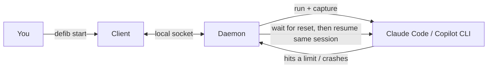

# defib

**Keep long-running AI coding-agent tasks alive across session limits, rate limits, credit
exhaustion, terminal crashes, and machine restarts.**

`defib` (as in *defibrillator*) is a local CLI supervisor. You hand it an agent task; it runs
the agent, watches for limit/quota/crash failures, waits until the limit resets or credits come
back, and then **resumes the same task** using the agent's own native session/resume mechanism.
Close your laptop, lose your terminal, hit your daily cap — the task picks up where it left off.

> **Status:** design phase. This repository currently contains the design and the
> implementation plan; the binary is being built milestone by milestone (see
> [TODO.md](TODO.md)). Commands below describe the intended v1 behavior.

## Why

Coding agents run long. Real runs hit walls: a rate limit at hour two, a monthly credit cap, an
"overloaded" error, or you just close the terminal. Re-driving the agent by hand loses context
and wastes your time. `defib` makes an agent run **durable** without changing how the agent
works.

## Features

- **Survives the things that kill long runs:** rate limits, quota/credit exhaustion, session
  limits, transient provider errors, terminal crashes, and machine reboots.
- **Native resume:** continues the *same* provider session so the agent keeps its context.
- **Smart waiting:** waits until the provider's own reset time when it can read it, otherwise
  backs off with jitter — and can probe for credit availability.
- **New or existing sessions:** start fresh, or point `defib` at a session you already have.
- **Provider-agnostic:** Claude Code is first-class; GitHub Copilot CLI is planned, behind the
  same abstraction.
- **Runs unattended, safely:** a background daemon owns your tasks; skip-approval "unattended"
  mode is strictly opt-in with a loud warning.
- **Single binary:** Go, no runtime, no server, local Unix-socket IPC only.

## How it works (in one picture)



The `defib` command you type is a thin client. A background **daemon** actually runs and
supervises your tasks, which is why they survive your terminal. On reboot, a small user service
restarts the daemon and it resumes in-flight tasks. Full design in
[docs/architecture.md](docs/architecture.md).

## Install

_Packaged binaries land with the release milestone ([TODO.md](TODO.md))._ From source:

```sh
go install ./cmd/defib        # from a checkout, once M0 is complete
```

## Quickstart

```sh
# Start a supervised Claude Code task in the current project.
defib start --provider claude -p "Refactor the auth module and add tests."

# Watch it live (Ctrl-C detaches without stopping the task).
defib attach <task>

# See everything you're supervising.
defib list

# Survive reboots: install the per-user background service.
defib install-service --start
```

Point defib at a session you already started instead of a new one:

```sh
defib start --provider claude --session <existing-session-id> -p "Continue where we left off."
```

The full command surface is in [docs/cli.md](docs/cli.md).

## Safety

Running an agent **unattended** can require the provider's "skip approvals" mode, which lets the
agent execute commands with no human in the loop. `defib` never enables this implicitly — it is
opt-in via `--unattended` / config and prints a warning. Prefer running unattended agents inside
a container or a sandboxed working copy. Details in
[docs/architecture.md](docs/architecture.md#security-model).

## Supported providers

| Provider | Status | Notes |
| --- | --- | --- |
| Claude Code | First-class (v1 target) | Native resume via session id; structured output. |
| GitHub Copilot CLI | Planned | Same abstraction; implemented after Claude. |
| `fake` | Built-in (testing) | Deterministic provider for tests and demos — no credits used. |

## Documentation

| Doc | For | Contents |
| --- | --- | --- |
| [docs/architecture.md](docs/architecture.md) | Understanding/implementing the system | Components, state machine, IPC, data model, recovery, security. |
| [docs/providers.md](docs/providers.md) | Adding/using providers | Provider interface and adapter contracts. |
| [docs/detection.md](docs/detection.md) | Tuning failure handling | Outcome categories and detection rules. |
| [docs/configuration.md](docs/configuration.md) | Configuring defib | Full config schema and precedence. |
| [docs/cli.md](docs/cli.md) | Using the CLI | Every command, flag, and exit code. |
| [docs/glossary.md](docs/glossary.md) | Everyone | Definitions of all terms. |
| [TODO.md](TODO.md) | Contributors | Milestones and tasks. |
| [AGENTS.md](AGENTS.md) | AI agents & contributors | How to work in this repo. |

## Contributing

See [CONTRIBUTING.md](CONTRIBUTING.md). If you are an AI coding agent, start at
[AGENTS.md](AGENTS.md).

## License

Apache-2.0. See [LICENSE](LICENSE).
