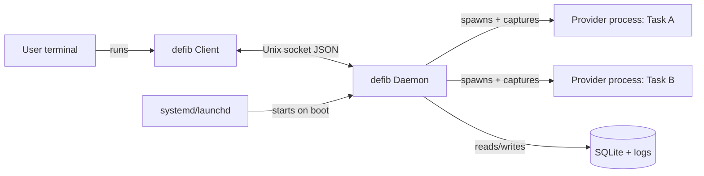
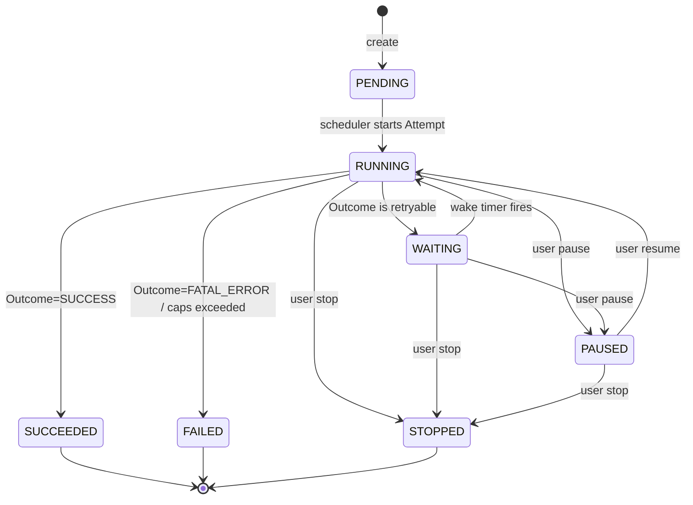

# Architecture

This is the **authoritative design document**. It defines the system's structure and the
rules implementers must follow. Terminology is defined once in [glossary.md](glossary.md);
provider specifics live in [providers.md](providers.md); the config schema lives in
[configuration.md](configuration.md); detection rules live in [detection.md](detection.md);
the command surface lives in [cli.md](cli.md). Do not duplicate those contents here.

> **Instruction to implementers:** This document is prescriptive. Do not deviate from the
> component boundaries, the state machine, the IPC protocol, or the data model without an
> explicit design change approved in an issue. If something here is ambiguous, stop and ask
> rather than inventing a solution.

## Contents

- [Goals and non-goals](#goals-and-non-goals)
- [Technology choices](#technology-choices)
- [Repository layout](#repository-layout)
- [Process model](#process-model)
- [Task lifecycle state machine](#task-lifecycle-state-machine)
- [Supervisor loop](#supervisor-loop)
- [Scheduling](#scheduling)
- [IPC protocol](#ipc-protocol)
- [Data model](#data-model)
- [On-disk layout](#on-disk-layout)
- [Persistence and atomicity](#persistence-and-atomicity)
- [Recovery](#recovery)
- [Concurrency model](#concurrency-model)
- [Security model](#security-model)
- [Extensibility](#extensibility)

## Goals and non-goals

**Goals**

1. Keep a long-running agent Task recoverable across: provider session limits, rate limits,
   credit/quota exhaustion, terminal crashes, and machine restarts.
2. Support Claude Code first, behind a Provider abstraction that also fits GitHub Copilot CLI.
3. Resume the *same* Task using the Provider's native session/resume mechanism when available.
4. Be configurable to either start a brand-new Session or attach to an existing one.
5. Be a single, dependency-light, cross-platform binary that a developer can trust to run
   unattended.

**Non-goals (v1)**

- Orchestrating multiple machines or remote execution.
- A web UI or hosted service.
- Editing or reviewing the agent's code output. defib supervises processes; it does not
  judge their work.
- Guaranteeing provider correctness. defib only observes exit codes and output.

## Technology choices

These are fixed decisions. Implementers must not swap these out.

| Concern | Choice | Rationale |
| --- | --- | --- |
| Language | **Go 1.22+** | Single static binary, first-class process control, easy cross-compilation, simple for contributors. |
| CLI framework | **`spf13/cobra`** (+ `spf13/pflag`) | Standard for Go CLIs; subcommands, help, flags. |
| Config format | **TOML** via **`github.com/pelletier/go-toml/v2`** | Human-friendly, comments, unambiguous types. |
| Persistence | **SQLite** via **`modernc.org/sqlite`** (pure Go, no cgo) using `database/sql` | Crash-safe (WAL), transactional, no external service, no cgo toolchain pain. |
| UUIDs | **`github.com/google/uuid`** | Task ids and pre-generated Session Refs. |
| Structured logging | stdlib **`log/slog`** | No extra dep; JSON to file, text to console. |
| PTY (interactive mode) | **`github.com/creack/pty`** | Used by interactive mode. |
| Terminal control (attach) | **`golang.org/x/term`** | Local terminal raw mode + window size for the interactive `attach` passthrough. |
| Testing | stdlib `go test` + **`github.com/stretchr/testify`** | Table-driven tests + assertions. |
| Lint | **`golangci-lint`** | CI gate. |

The IPC transport is a Unix domain socket with newline-delimited JSON — **no gRPC, no HTTP
server**. Keep dependencies minimal.

> **Windows note:** v1 targets Linux and macOS. Windows support (named pipes instead of a
> Unix socket, Scheduled Task instead of systemd/launchd) is explicitly deferred. Do not add
> Windows-specific code paths unless a tracked issue calls for it.

## Repository layout

This is the canonical layout. Every package has a single responsibility. Do not create new
top-level packages without updating this document.

```
defib-my-agent/
  cmd/
    defib/              # main(): wires cobra CLI; no business logic here
  internal/
    cli/                # cobra command definitions; thin — only parse+call ipc client
    ipc/                # socket protocol: framing, request/response, streaming, client+server
    daemon/             # daemon server: task registry, event bus, lifecycle wiring
    supervisor/         # per-Task state machine (pure logic, no I/O side effects where possible)
    scheduler/          # backoff + reset-time + caps -> next wake time; timer wheel
    provider/           # Provider interface, registry, selection
      claude/           # Claude Code adapter
      copilot/          # Copilot CLI adapter
      fake/             # deterministic test/dev provider (see Testing in AGENTS.md)
    detect/             # detection engine + rule types (data-driven)
    process/            # child process runner: spawn, process group, log capture, kill tree
    store/              # SQLite access + models + migrations
    config/             # layered config loading, schema structs, validation
    logging/            # slog setup + secret redaction
    service/            # systemd/launchd unit generation + install/uninstall
    paths/              # resolves state/config/runtime dirs (XDG + macOS) + task artifact paths
  docs/                 # design docs (this folder)
  testdata/             # fixtures: sample provider outputs, config files
  Makefile
  go.mod
```

**Dependency direction (must not be violated):** `cli` → `ipc` (client). `daemon` →
`supervisor`, `scheduler`, `provider`, `detect`, `process`, `store`, `config`. Lower-level
packages (`store`, `config`, `process`, `detect`, `scheduler`, `paths`, `logging`) must not
import `daemon`, `supervisor`, or `cli`. `provider` adapters may import `detect` and `process`.

## Process model



- The **Client** is stateless and short-lived. It connects to the Daemon socket, sends one
  request, streams/receives the response, and exits. If no Daemon is running, the Client
  auto-starts one (`defib daemon run`, detached) unless `--no-autostart` is given.
- The **Daemon** is the single owner of all state and all Provider child processes. This is
  what makes Tasks survive a terminal crash: killing the terminal kills the Client, not the
  Daemon or its children.
- Machine-restart survival is provided by a user-level **service** (systemd user unit /
  launchd LaunchAgent) that runs `defib daemon run` on login/boot, which then performs
  [Recovery](#recovery).

**Why a single daemon (not per-task detached processes):** centralizing the scheduler,
persistence, and detection in one place means the hard logic is written once, reconciliation
after a restart is a single well-defined routine, and `list`/`status` are trivial. Weak
implementers should not be spreading lifecycle logic across many independent processes.

## Task lifecycle state machine

States (see [glossary.md](glossary.md) for terminal-state definition):

`PENDING`, `RUNNING`, `WAITING`, `PAUSED`, `SUCCEEDED` (terminal), `FAILED` (terminal),
`STOPPED` (terminal).



**Transition table** — the Supervisor must implement exactly these transitions. `Retryable`
Outcomes are `RATE_LIMIT`, `QUOTA_EXHAUSTED`, `SESSION_LIMIT`, `TRANSIENT_ERROR`, and
`UNKNOWN` (only if config `on_unknown = "retry"`; otherwise treat as `FATAL_ERROR`).

| From | Event | Guard | To | Side effects |
| --- | --- | --- | --- | --- |
| PENDING | `start` | — | RUNNING | Spawn Attempt 1. |
| WAITING | `timer_fire` | now ≥ next_wake_at | RUNNING | Spawn next Attempt (Resume if Session Ref exists, else fresh start with same Session mode). |
| RUNNING | `attempt_exit` | Outcome=SUCCESS | SUCCEEDED | Record Outcome; close Task. |
| RUNNING | `attempt_exit` | Outcome=FATAL_ERROR | FAILED | Record reason. |
| RUNNING | `attempt_exit` | Outcome retryable AND caps not exceeded | WAITING | Compute `next_wake_at` (see [Scheduling](#scheduling)); persist; arm timer. |
| RUNNING | `attempt_exit` | Outcome retryable AND caps exceeded | FAILED | Record reason = which cap was hit. |
| RUNNING/WAITING | `user_pause` | — | PAUSED | If RUNNING, do **not** kill child by default (see note); cancel any armed timer. |
| PAUSED/WAITING | `user_resume` | — | RUNNING | Spawn next Attempt immediately (skip remaining wait). |
| any non-terminal | `user_stop` | — | STOPPED | Kill child process group if running; cancel timer. |
| RUNNING | `daemon_reconcile` | child no longer live | WAITING or RUNNING | See [Recovery](#recovery). |

> **Pause note:** `pause` while `RUNNING` marks intent to not schedule the *next* Attempt.
> The current child is allowed to finish. A separate `stop` is the hard kill. This keeps
> `pause` non-destructive. Document this clearly to users in [cli.md](cli.md).

**Caps evaluation** happens at the RUNNING→WAITING decision point. A cap is exceeded when any
of: `attempt_no >= max_attempts`, `now >= deadline_at`, or
`cumulative_wait + proposed_wait > max_total_wait`. On exceed → FAILED with a specific reason.

## Supervisor loop

Reference pseudocode for one Task (implemented in `internal/supervisor`). Keep it this
simple. The Supervisor receives events and emits actions; the Daemon performs I/O.

```
loop:
  event = wait_for_event()          # attempt_exit | timer_fire | user_* | reconcile
  switch (state, event):
    (PENDING|WAITING|PAUSED, start/timer_fire/user_resume):
        attempt = new_attempt()
        cmd = provider.build_start_or_resume(task, session_ref)   # resume if session_ref set
        state = RUNNING
        daemon.spawn(attempt, cmd)                                 # async; will emit attempt_exit

    (RUNNING, attempt_exit(exit_code, logs)):
        outcome, reset_at = detect.classify(provider, exit_code, logs)
        record_attempt(outcome, reset_at)
        if provider produced a Session Ref this Attempt: task.session_ref = parsed_ref
        switch outcome:
          SUCCESS:            state = SUCCEEDED
          FATAL_ERROR:        state = FAILED
          retryable:
            if caps_exceeded(): state = FAILED (reason=cap)
            else:
              next_wake_at = scheduler.next_wake(task, attempt, reset_at)
              state = WAITING
              daemon.arm_timer(task, next_wake_at)

    (any_non_terminal, user_stop): kill_child(); state = STOPPED
    (RUNNING|WAITING, user_pause): cancel_timer(); state = PAUSED
  persist(task)                      # single transaction; see Persistence
```

## Scheduling

Implemented in `internal/scheduler`. Given a Task, the just-finished Attempt number `n`, and
an optional `reset_at`, compute the next wake time.

```
base        = policy.backoff_base           (default 30s)
factor      = policy.backoff_factor         (default 2.0)
max_delay   = policy.backoff_max            (default 1h)
jitter_frac = policy.backoff_jitter         (default 0.2, i.e. ±20%)
buffer      = policy.reset_buffer           (default 15s, added after a Reset Time)

backoff(n)  = min(max_delay, base * factor^(n-1))
delay       = full_jitter(backoff(n), jitter_frac)      # uniform in [d*(1-j), d*(1+j)]

if reset_at is present and reset_at > now:
    candidate = reset_at + buffer                        # prefer the provider's own reset
else:
    candidate = now + delay

next_wake_at = min(candidate, deadline_at)               # never schedule past the deadline
```

Rules:
- A known Reset Time always wins over Backoff (the provider told us when it clears).
- `QUOTA_EXHAUSTED` with no Reset Time uses Backoff, but the Scheduler also honors the
  optional Availability Probe (see [providers.md](providers.md) and
  [configuration.md](configuration.md)): if a probe command is configured, the Daemon runs it
  at `availability.poll_interval` and wakes the Task early when it succeeds.
- Jitter is mandatory to avoid thundering-herd resumes when many Tasks share one limit.

## IPC protocol

**Transport:** Unix domain socket at the Runtime dir path (see [On-disk layout](#on-disk-layout)),
mode `0600`. **Framing:** newline-delimited JSON — exactly one JSON object per line, UTF-8.

**Request:**
```json
{ "id": "<client-generated-uuid>", "method": "task.create", "params": { } }
```

**Response(s):** one or more objects sharing the request `id`:
```json
{ "id": "...", "ok": true, "result": { } }                     // terminal, single-shot
{ "id": "...", "ok": true, "stream": true, "event": { } }      // streaming chunk
{ "id": "...", "ok": true, "done": true }                      // stream end
{ "id": "...", "ok": false, "error": { "code": "…", "message": "…" } }
```

**Methods** (params/results are detailed as data structures in [Data model](#data-model) and
the flags that populate them in [cli.md](cli.md)):

| Method | Kind | Purpose |
| --- | --- | --- |
| `daemon.ping` | single | Liveness + version + schema version. |
| `daemon.shutdown` | single | Graceful daemon stop (children detached or stopped per param). |
| `task.create` | single | Create + start a Task. Returns the Task summary. |
| `task.list` | single | All Tasks with status. |
| `task.get` | single | One Task with Attempts. |
| `task.resume` | single | Force an immediate next Attempt (skip wait). |
| `task.pause` | single | Pause a Task. |
| `task.stop` | single | Stop (kill) a Task. |
| `task.remove` | single | Remove a terminal Task and its artifacts. |
| `task.logs` | stream | Stream stored (and optionally live) log lines. |
| `events.subscribe` | stream | Stream Task state-change events (used by `attach`). |
| `task.attach` | stream | Stream an interactive Task's live PTY output (see [Interactive attach](#interactive-attach)). |
| `task.input` | single | Forward input bytes to an interactive Task's live PTY. |
| `task.resize` | single | Set an interactive Task's PTY window size. |

**Error codes** (string enum): `not_found`, `invalid_params`, `conflict` (illegal state
transition), `provider_unavailable`, `internal`. Clients map these to process exit codes per
[cli.md](cli.md).

### Interactive attach

A Task created with `mode=interactive` (only when the Provider advertises
`Capabilities.Interactive`) runs its child under a pseudo-terminal (`internal/process`
PTY runner). The Daemon owns that PTY; a Client `attach`es to drive it and may detach
without disturbing it — the same terminal-crash-survival guarantee headless Tasks get.

**Protocol decision.** Input forwarding reuses the existing newline-JSON framing rather than
adding a new transport. It is expressed as three Task-scoped methods, correlated by Task id —
exactly like the existing multi-connection `attach` (which already spans `events.subscribe` +
`task.logs`). A Client may open a separate connection per direction; the Daemon routes by Task
id to the one live PTY:

- **`task.attach`** (stream) — `params {"task": "<selector>"}`. The Daemon first replays the
  retained output tail (so a late joiner sees current screen state), then streams live chunks
  `{"data": "<base64>"}`. Bytes are raw terminal output (control sequences included) and are
  base64-encoded so the one-JSON-object-per-line framing is preserved. The stream ends (`done`)
  when the current Attempt's child exits or the Client disconnects. It is a `conflict` if the
  Task has no live PTY (not `mode=interactive`, or currently between Attempts).
- **`task.input`** (single) — `params {"task": "<selector>", "data": "<base64>"}`. Writes the
  bytes to the PTY as if typed. `conflict` if there is no live PTY.
- **`task.resize`** (single) — `params {"task": "<selector>", "rows": N, "cols": N}`. Sets the
  PTY window size (delivers `SIGWINCH` to the child). `conflict` if there is no live PTY.

**Detach is non-destructive.** Detaching only closes the Client's connections; the Daemon keeps
the PTY and its child running. The live view is best-effort: per-subscriber output buffers are
bounded and drop under back-pressure rather than stall the child — the authoritative capture is
the Attempt log file. The retained tail is bounded by `detect.scan_bytes`.

## Data model

SQLite schema owned by `internal/store`. Migrations are ordered SQL files embedded in the
binary; `daemon_meta.schema_version` tracks the applied version. Timestamps are stored as
RFC3339 UTC strings. JSON columns store serialized structs.

```sql
CREATE TABLE tasks (
  id              TEXT PRIMARY KEY,          -- uuid
  name            TEXT NOT NULL,             -- human label (defaults to short id)
  provider        TEXT NOT NULL,             -- 'claude' | 'copilot' | 'fake'
  mode            TEXT NOT NULL,             -- 'headless' | 'interactive'
  cwd             TEXT NOT NULL,             -- working directory for the provider
  session_mode    TEXT NOT NULL,             -- 'new' | 'existing'
  session_ref     TEXT,                      -- provider session id (nullable until known)
  prompt          TEXT,                      -- initial instruction (nullable if passthrough only)
  args_json       TEXT NOT NULL DEFAULT '[]',-- extra passthrough argv
  config_json     TEXT NOT NULL,             -- resolved policy snapshot at create time
  status          TEXT NOT NULL,             -- PENDING|RUNNING|WAITING|PAUSED|SUCCEEDED|FAILED|STOPPED
  current_attempt INTEGER NOT NULL DEFAULT 0,
  total_attempts  INTEGER NOT NULL DEFAULT 0,
  next_wake_at    TEXT,                      -- when WAITING
  last_outcome    TEXT,                      -- last Attempt Outcome
  last_reset_at   TEXT,                      -- last detected Reset Time
  cumulative_wait_ms INTEGER NOT NULL DEFAULT 0,
  deadline_at     TEXT,                      -- absolute cap (nullable = no deadline)
  exit_reason     TEXT,                      -- set on terminal state
  created_at      TEXT NOT NULL,
  updated_at      TEXT NOT NULL
);

CREATE TABLE attempts (
  id           TEXT PRIMARY KEY,             -- uuid
  task_id      TEXT NOT NULL REFERENCES tasks(id) ON DELETE CASCADE,
  attempt_no   INTEGER NOT NULL,
  pid          INTEGER,
  started_at   TEXT NOT NULL,
  ended_at     TEXT,
  exit_code    INTEGER,
  outcome      TEXT,                         -- Outcome Category
  reset_at     TEXT,                         -- Reset Time if detected
  matched_rule TEXT,                         -- name of the detection rule that fired
  stdout_path  TEXT NOT NULL,                -- file under the Task's attempts dir
  stderr_path  TEXT NOT NULL,
  UNIQUE(task_id, attempt_no)
);

CREATE TABLE events (
  id       INTEGER PRIMARY KEY AUTOINCREMENT,
  task_id  TEXT REFERENCES tasks(id) ON DELETE CASCADE,
  ts       TEXT NOT NULL,
  type     TEXT NOT NULL,                    -- state_change|attempt_start|attempt_exit|scheduled|user_action
  detail_json TEXT NOT NULL DEFAULT '{}'
);

CREATE TABLE daemon_meta (
  key   TEXT PRIMARY KEY,                    -- schema_version|pid|started_at|version
  value TEXT NOT NULL
);
```

Enable `PRAGMA journal_mode=WAL;` and `PRAGMA foreign_keys=ON;` on every connection.

## On-disk layout

Paths are resolved by `internal/paths` using XDG on Linux and the equivalent macOS
conventions. Environment overrides: `DEFIB_STATE_DIR`, `DEFIB_CONFIG_DIR`, `DEFIB_RUNTIME_DIR`.

| Kind | Linux (default) | macOS (default) | Contents |
| --- | --- | --- | --- |
| Config dir | `$XDG_CONFIG_HOME/defib` → `~/.config/defib` | `~/Library/Application Support/defib` | `config.toml` |
| State dir | `$XDG_STATE_HOME/defib` → `~/.local/state/defib` | `~/Library/Application Support/defib/state` | `defib.db`, `daemon.log`, `tasks/…` |
| Runtime dir | `$XDG_RUNTIME_DIR/defib` → fallback to State dir | `~/Library/Application Support/defib/run` | `daemon.sock`, `daemon.pid` |

State dir tree:
```
<state>/
  defib.db
  daemon.log
  tasks/
    <task-id>/
      attempts/
        1/ stdout.log  stderr.log  meta.json
        2/ stdout.log  stderr.log  meta.json
```
Directory permissions: State dir and Config dir `0700`; socket `0600`.

## Persistence and atomicity

- Every state transition persists inside a **single SQLite transaction** that updates
  `tasks`, inserts the relevant `attempts`/`events` rows, and commits. The in-memory Task and
  the DB row must never diverge: update memory only after the transaction commits.
- Log files are append-only; they are written by the `process` package as the child emits
  output and are **not** part of the transaction. The DB stores only their paths.
- Writes to `meta.json` and any config-like files use write-temp-then-rename for atomicity.
- The Daemon holds a single writer connection; readers (e.g. `list`) may use separate
  read-only connections (WAL allows concurrent reads).

## Recovery

Three recovery scenarios, all handled by one reconciliation routine at Daemon startup
(`daemon.Reconcile`) plus continuous ownership by the Daemon.

1. **Terminal crash (Client dies, Daemon lives).** Nothing to recover — the Daemon and
   Provider children are unaffected. A new Client simply reconnects.

2. **Daemon restart (crash or `daemon.shutdown` then restart).** On startup:
   - Run DB migrations; load every Task not in a terminal state.
   - For each `RUNNING` Task: the Provider child is gone (its parent died). Treat as an
     interrupted Attempt: mark that Attempt `ended_at` now with `outcome=UNKNOWN`
     (`matched_rule="daemon_interrupted"`), then apply the retryable policy — go to `WAITING`
     with an immediate or backed-off wake (config `on_interrupt = "resume_now" | "backoff"`).
     Resume uses the stored `session_ref` so context is preserved.
   - For each `WAITING` Task: re-arm the timer. If `next_wake_at` is in the past, wake now.
   - For each `PAUSED` Task: leave paused.

3. **Machine restart.** The service manager starts `defib daemon run` on login/boot; that
   triggers scenario 2. Installation is handled by `internal/service` (see
   [providers.md](providers.md) is *not* where this lives — service install is a Daemon
   concern; commands are in [cli.md](cli.md)).

`Reconcile` must be **idempotent** and safe to run repeatedly.

## Concurrency model

- One goroutine per active Task Supervisor, fed by a per-Task buffered event channel. All
  mutations of a Task's in-memory state happen on that single goroutine — no shared mutable
  Task state across goroutines.
- The `process` package runs each child with its own goroutines for stdout/stderr capture and
  posts a single `attempt_exit` event to the owning Task channel when the child exits.
- The Scheduler uses one timer per WAITING Task; on fire it posts `timer_fire` to the Task
  channel. No busy-waiting; never `sleep`-poll in a loop.
- The IPC server accepts connections on its own goroutine and dispatches requests to the
  Daemon, which forwards user actions as events to the relevant Task channel. Responses to the
  client are sent after the action is accepted (not after it fully completes, for long ops).
- The single SQLite writer is serialized through the store package (one `*sql.DB` with
  `SetMaxOpenConns(1)` for the writer path, or an explicit mutex).

## Security model

defib runs trusted local processes on behalf of the user, but must still be careful:

- **Socket & files:** Runtime socket `0600`; State/Config dirs `0700`. Refuse to start if the
  socket path is world-writable or owned by another user.
- **Task id validation:** Task ids are UUIDs; never build filesystem paths from
  externally-supplied strings without validating them against a `^[a-f0-9-]{36}$` pattern to
  prevent path traversal.
- **Secret redaction:** `internal/logging` redacts known token shapes (e.g. `sk-…`,
  `ghp_…`, `Bearer …`, `Authorization:` headers, values of env vars named like
  `*_TOKEN`/`*_KEY`/`*_SECRET`) from captured Provider logs and from defib's own logs. This is
  best-effort; document it as such.
- **Hooks run without a shell:** Availability probes and notification hooks are executed as
  argv arrays via `os/exec` — **never** through `sh -c`. This avoids shell injection from
  config. Document that config files are trusted input owned by the user.
- **Unattended permission risk:** Running an agent unattended may require the provider's
  "skip approvals" flag. This is dangerous (the agent can run arbitrary commands with no human
  in the loop). defib must (a) never enable it implicitly, (b) require an explicit opt-in flag
  or config, and (c) print a prominent warning. Recommend sandboxing/containers in the README.
- **No network listeners:** defib exposes no TCP ports. All IPC is local Unix socket.

## Extensibility

- **New Provider:** implement the interface in [providers.md](providers.md), register it in
  `internal/provider`, and ship default detection rules per [detection.md](detection.md). No
  changes to the Supervisor, Scheduler, or IPC are needed for a new Provider.
- **New detection rule:** data-driven — add to the built-in rule set or let users add rules in
  `config.toml`. See [detection.md](detection.md).
- **New CLI command:** add a cobra command in `internal/cli` and, if it needs Daemon data, a
  new IPC method. Keep the Client thin.
